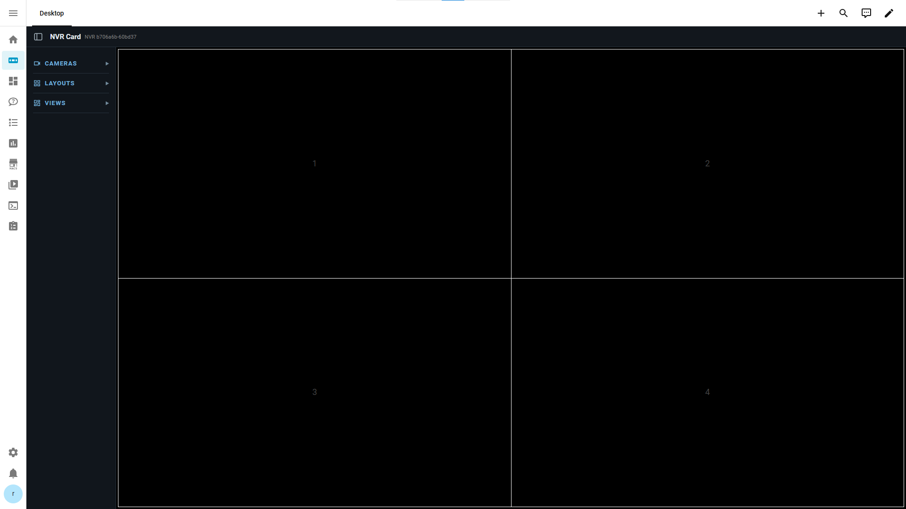
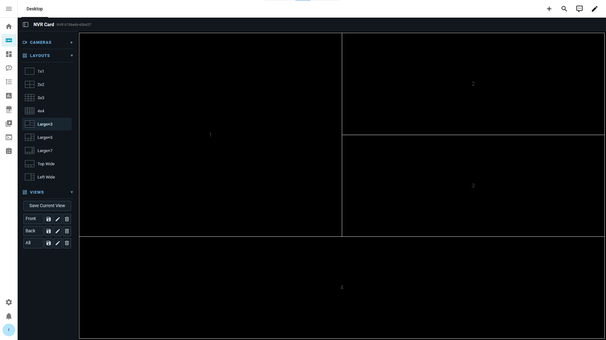

# NVR Card

NVR Card is a custom Home Assistant Lovelace card for presenting multiple HA
camera entities in an NVR-style interface. It provides configurable camera
inventory, persistent grid cells, layouts, Saved Views, maximized viewing,
live-status monitoring, bounded presentation recovery, and optional tablet
auto-dim.

The current live-video path is deliberately HA-managed: NVR Card selects the
configured HA camera entity and presents it through Home Assistant's
`hui-image` component. Home Assistant owns the actual player and media
transport; NVR Card owns camera organization, presentation-source selection,
layout, interaction, persistence, liveness observation, and display
orchestration.

## Screenshots






## Features

- Configurable camera inventory with installation-specific HA entity IDs.
- Up to 16 simultaneously assigned camera positions and built-in layouts.
- Separate normal/grid and maximized live sources, preferably HA ONVIF Sub
  Stream 1 for grid and HA ONVIF Main Stream when maximized.
- Maximize/restore and horizontal touch or pen swipe while maximized.
- Saved Views with create, load, update, rename, and delete operations.
- Per-Home-Assistant-user workspace persistence, scoped to the dashboard path.
- Passive live-status and stall detection.
- One bounded presentation replacement per continuous stall episode.
- Optional tablet brightness ownership and inactivity auto-dim.
- A displayed build identifier next to the card title.

## Tested Environment

These are the environments used for runtime acceptance testing. They are not
minimum supported-version claims.

| Component | Tested version/environment |
| --- | --- |
| Home Assistant Core | 2026.9.1 |
| Home Assistant Supervisor | 2026.08.0 |
| Home Assistant OS | 18.2 |
| Home Assistant frontend | 20260826.6 |
| Tablet | Samsung Galaxy Tab A11 Plus, model SM-X230 |
| Android / One UI | Android 16 / One UI 8.0 |
| Home Assistant Companion | 2026.6.5-full |
| Frigate | 0.17.2-3d4dd3a |

## Requirements

For ordinary live viewing you need:

- Home Assistant with JavaScript module resources enabled;
- HA camera entities available for the cameras you want to display;
- the relevant ONVIF profile entities for the preferred Sub1/Main mapping.

Frigate is not required for the active mapped live-presentation path. It may
be used as the logical `camera.entity` in an existing installation, but the
card does not require that entity to be a Frigate entity.

The Android Home Assistant Companion App is required only when using
`auto_dim`.

## Installation

There is currently no HACS package or release installer. Download the project
from its repository or project distribution, then create this directory if it
does not exist:

```text
/config/www/nvr-card/
```

Copy the following files and directories into it, preserving this structure:

```text
nvr-card.js
loader.js
src/live/*.js
src/providers/*.js
src/vendor/go2rtc/*
```

In Home Assistant's dashboard resource configuration, register exactly one
JavaScript module resource:

```text
/local/nvr-card/loader.js
```

`loader.js` dynamically loads `nvr-card.js`. Do not separately register
`nvr-card.js` when using the loader.

Then add a Manual card to a dashboard. A minimal card is:

```yaml
type: custom:nvr-card
cameras: []
```

Refresh the HA frontend or Companion App after installation or deployment so
the new resource is loaded.

The repository's Windows development deployment helper is described in
[Development, testing, and deployment](#development-testing-and-deployment).

## Quick Start: connecting cameras

Each camera definition has four relevant concepts:

- `name` is the human-readable label shown by NVR Card.
- `entity` is the stable logical HA camera identity used for assignments,
  workspace state, sidebar availability, and fallback presentation.
- `live.substream` is the HA camera entity used in normal/grid presentation.
- `live.mainstream` is the HA camera entity used while maximized.

To connect a camera:

1. Configure the physical camera in Home Assistant through the ONVIF
   integration when using the preferred mapped architecture.
2. Open HA's entity list and find the entities belonging to that device.
3. Identify the lower-bandwidth Sub Stream 1 entity.
4. Identify the Main Stream entity.
5. Put those exact entity IDs in `live.substream` and `live.mainstream`.
6. Select a stable HA camera entity for `entity`.
7. Test both grid and maximized presentation.

Entity IDs are installation-specific. The card does not automatically discover
or configure ONVIF profiles, codecs, resolutions, bitrates, or transports.
When `live` is omitted, both grid and maximized modes fall back to
`camera.entity`.

Example using generic entity names:

```yaml
cameras:
  - name: Front Door
    entity: camera.front_door
    active: true
    live:
      substream: camera.front_door_sub_stream_1
      mainstream: camera.front_door_main_stream
```

## Complete configuration example

```yaml
type: custom:nvr-card
camera_aspect_ratio: "16:9"

cameras:
  - name: Camera A
    entity: camera.camera_a
    active: true
    live:
      substream: camera.camera_a_sub_stream_1
      mainstream: camera.camera_a_main_stream
  - name: Camera B
    entity: camera.camera_b
    active: true
    live:
      substream: camera.camera_b_sub_stream_1
      mainstream: camera.camera_b_main_stream

live_status:
  position: bottom-left

live_recovery:
  enabled: true
  stall_after: 10
  reconnect_after: 360

auto_dim:
  enabled: true
  timeout: 300
  fade_duration: 8
  normal_brightness: 180
  dim_brightness: 0
  notify_service: notify.mobile_app_wall_tablet
```

`auto_dim` is optional and is normally used only in the card configuration
shown on the tablet dashboard.

## Configuration reference

Unknown top-level fields are currently ignored. Unknown camera fields and
unknown fields inside `live` are rejected.

### Card and camera options

| Path | Type and default | Rules and effect |
| --- | --- | --- |
| `type` | Required Lovelace string | Use `custom:nvr-card`. It is handled by HA rather than the card parser. |
| `cameras` | Required array | Empty is allowed; at most 256 definitions. |
| `cameras[].name` | Required string | Must be nonempty after trimming and case-sensitively unique. Display label and logical camera name. |
| `cameras[].entity` | Required string | Must be nonempty after trimming. Persistent logical identity, availability source, and fallback live source. |
| `cameras[].active` | Optional boolean, `true` | Inactive cameras are excluded from normal sidebar assignment and maximized swipe traversal. Other types are invalid. |
| `cameras[].live` | Optional object | If supplied, it must contain exactly `substream` and `mainstream`. |
| `cameras[].live.substream` | Required when `live` exists | Nonempty HA entity ID for grid presentation. |
| `cameras[].live.mainstream` | Required when `live` exists | Nonempty HA entity ID for maximized presentation. |
| `camera_aspect_ratio` | Optional string, `"16:9"` | Exactly one colon; both sides must be positive finite numbers. Controls fitting. |
| `live_status.position` | Optional string, `bottom-left` | Valid values are `bottom-left`, `bottom-right`, `top-left`, and `top-right`. Invalid values use `bottom-left`. |

### Live recovery options

| Path | Type and default | Rules and effect |
| --- | --- | --- |
| `live_recovery.enabled` | Boolean, `false` | Only literal `true` enables terminal recovery. |
| `live_recovery.stall_after` | Number/string, `10` seconds | Clamped to 5–300 seconds. Controls passive stall detection even when recovery is disabled. |
| `live_recovery.reconnect_after` | Number/string, `360` seconds | Clamped to 60–86400 seconds. Additional continuous stalled time before one replacement attempt. |

Invalid, empty, nonfinite, zero, negative, or boolean duration values use the
respective defaults.

### Auto-dim options

| Path | Type and default | Rules and effect |
| --- | --- | --- |
| `auto_dim.enabled` | Boolean, `false` | Literal `true` enables tablet display ownership. |
| `auto_dim.timeout` | Number/string, `300` seconds | Clamped to 1–86400 seconds. Full inactivity interval before fading. |
| `auto_dim.fade_duration` | Number/string, `8` seconds | Clamped to 0–300 seconds. Zero sends the dim level directly. |
| `auto_dim.normal_brightness` | Number/string, `180` | Rounded to an integer in the range 0–255. Must exceed dim brightness when enabled. |
| `auto_dim.dim_brightness` | Number/string, `0` | Rounded to an integer in the range 0–255. Zero means brightness level zero, not guaranteed power-off. |
| `auto_dim.notify_service` | String, no default | Required when enabled; must match `notify.<service_name>`. |

Invalid numeric values use their field defaults. `auto_dim` must be an object,
`enabled` must be a boolean, and an enabled configuration must have a valid
`notify_service` with `normal_brightness` greater than `dim_brightness`.
Otherwise auto-dim is disabled until the configuration is corrected. The
canonical configuration names above use snake_case.

## Using the card

The camera sidebar shows active cameras. Cameras can be assigned by selecting
and clicking a grid slot or by dragging. Grid cameras can be moved between
slots. Right-click or open the context menu on an assigned camera and choose
Close Camera to remove it.

The card supports up to 16 simultaneously assigned camera positions. Layout
changes preserve existing camera presentations where possible, and cameras
outside the current layout remain available when a larger layout is selected.

Built-in layouts include 1x1, 2x2, 3x3, 4x4, Large+3, Large+5, Large+7, Top
Wide, and Left Wide.

Double-click an assigned camera position to maximize it and double-click again
to restore. While maximized, swipe horizontally with touch or pen input:
swipe right for the next active camera and left for the previous active camera.
Traversal wraps around. Swipe browsing uses a temporary maximized-camera
override; it does not rewrite the saved layout or the pre-maximized
assignments. Restoring returns to that previous view.

Saved Views capture the layout, assignments, and maximized slot. They support
create, load, update, rename, and delete; names are trimmed and must be
case-insensitively unique. Relevant operations use browser-native dialogs.

Workspace data is stored per HA user through the HA frontend and is scoped by
dashboard pathname. Separate HA dashboards or views are the normal way to
provide desktop and tablet configurations. NVR Card does not detect device
type or provide device-specific dashboard selection.

## Tablet auto-dim

Auto-dim requires the Home Assistant Companion App on the tablet, the
tablet's `notify.mobile_app_*` service, and Android permission for the
Companion App to change system settings/brightness. The tested device was a
Samsung Galaxy Tab A11 Plus (SM-X230), Android 16 / One UI 8.0, using
Companion `2026.6.5-full`.

Find the actual service name in the current HA Actions interface by searching
for `mobile_app`; do not assume a particular device suffix. The complete
configuration example above uses the generic service
`notify.mobile_app_wall_tablet`.

The tested device required the Android permission labelled “Allow this app to
change system settings”. Wording and location may vary by Android/device
version.

When enabled, the card establishes display ownership using these Companion
commands:

- `command_auto_screen_brightness`;
- `command_screen_on` with `keep_screen_on`;
- `command_screen_brightness_level`.

The card starts inactivity timing only after ownership succeeds. Activity
resets the full timeout while awake and restores brightness while dimming.
Home Assistant editing activity is observed without consuming the event, and
blocking Saved View prompts receive a fresh full timeout after they close.

Reconnect/reattach can re-establish ownership. A command failure suspends
auto-dim until recovery activity or reconnect; there is no polling retry loop.
Disabling attempts to restore normal brightness, but does not restore previous
Android automatic-brightness or timeout settings.

`dim_brightness: 0` selects brightness level zero. It is not a guarantee that
the display powers off.

## Live status and recovery

`live_status.position` controls the status indicator corner. Continuous
frame-progress liveness depends on `requestVideoFrameCallback` when available.
`loadeddata` and `playing` events provide limited first-event evidence, but are
not equivalent continuous frame monitoring.

After the configured `stall_after` interval, the presentation can show a
stalled state. If recovery is enabled, one terminal replacement of the
affected `hui-image` presentation is attempted after `reconnect_after` more
seconds of continuous stall. A genuine frame from the current presentation
clears the episode and permits a future independent recovery.

Recovery replaces only the affected presentation subtree. It does not reboot
or restart Home Assistant, ONVIF, the camera, Frigate, or network services.

## Current limitations

- Installation is manual; there is no HACS package currently.
- A maximum of 256 camera definitions is accepted, but only 16 camera
  positions can be assigned simultaneously.
- ONVIF Sub1/Main mapping is manual and installation-specific.
- The card does not configure ONVIF profiles, codecs, resolution, bitrate, or
  transport.
- NVR cards for the same HA user and dashboard pathname use the same workspace
  storage key, so their workspace writes may share or overwrite state.
- Desktop/tablet separation is provided by HA dashboards/views, not device
  detection in the card.
- Brightness zero is not a screen-off guarantee.
- Continuous frame-progress monitoring depends on
  `requestVideoFrameCallback`; fallback media events are limited and are not
  equivalent.
- Terminal recovery is bounded to one replacement per continuous stall.
- Saved View dialogs use browser-native prompt/confirm UI.
- Some behavior depends on HA frontend components and internal storage APIs;
  frontend upgrades may require compatibility work.

## Developer guide

### Architectural ownership

NVR Card orchestrates; Home Assistant remains the video system.

Home Assistant owns camera entities, ONVIF integration, `hui-image`, and the
underlying player/media transport. NVR Card owns logical identity, source
selection, Sub1/Main switching, layouts, persistent cells, assignment,
maximize/restore, Saved Views, workspace persistence, liveness observation,
bounded presentation recovery, and tablet display orchestration.

The important flow is:

```text
setConfig()
  -> normalized logical cameras
  -> persistent physical cells
  -> getCameraLiveSource()
  -> HA hui-image
  -> HA-owned media presentation
```

Grid mode selects the configured substream; maximized mode selects the
mainstream. Ordinary maximize/restore preserves the physical cell and player
relationship instead of rebuilding the entire card.

### Source map

| Path | Responsibility |
| --- | --- |
| `nvr-card.js` | Main custom element, configuration, UI, layout, persistence, auto-dim, liveness, recovery, and geometry. Entry points include `setConfig()`, `getCameraLiveSource()`, `renderSlot()`, and `updateAvailableHeight()`. |
| `loader.js` | Dynamic module loading with cache-busting. |
| `src/live/*` | Live orchestration contracts and dormant/tested presentation abstractions. |
| `src/providers/frigate-provider.js` | Provider-native Frigate/go2rtc path retained in the repository but not active with the current HA `hui-image` flag. |
| `src/vendor/go2rtc/*` | Vendored/adapted upstream video code and license material. |
| `test/*.test.js` | Node built-in test suites using Happy DOM and focused lifecycle/configuration/gesture/recovery tests. |
| `deploy-to-ha.ps1` | Windows deployment and build verification. |

### Persistence

`HomeAssistantUserStateStore` uses the frontend WebSocket commands
`frontend/get_user_data` and `frontend/set_user_data`. The workspace key is
pathname-scoped and HA scopes the data to the current user. It stores view
state and Saved Views.

Async hydration uses generation and revision protections so stale remote
results do not overwrite newer local interaction. Legacy pathname-scoped
localStorage state can migrate when no valid remote workspace exists.

The specific frontend user-data commands appear to be HA frontend/internal
APIs, not stable documented public APIs. Treat them as compatibility-sensitive.

### Auto-dim and liveness

Auto-dim state is instance-local. Notification commands are serialized;
ownership, timers, fades, wake handling, blocking-dialog handling, and
disconnect/reconnect generations are kept separate from camera media state.

Liveness passively observes HA-owned video. `requestVideoFrameCallback`
provides continuous frame evidence where available; fallback media events are
limited. Presentation generations prevent old callbacks from clearing current
stalls. Recovery remains scoped to one affected `hui-image` subtree and does
not become a general media restart system.

### HA integration and geometry

`hui-image` and its shadow-root structure are HA frontend implementation
dependencies rather than a stable custom-card API. Traversing open shadow
roots and locating downstream video should therefore be treated as
compatibility-sensitive.

The card uses `isolation: isolate` on its HA card boundary to contain stacking
contexts. Available height uses a stable document/page vertical origin derived
from `getBoundingClientRect()` and the visual viewport, with a `window.scrollY`
fallback. Generic nested scroll-container compensation is not implemented.

### Dormant provider path

Frigate/provider-native and go2rtc modules remain in the repository and are
deployed for the current module tree, but the active production presentation
path uses HA `hui-image`. Do not treat those provider modules as the current
user-facing live-video path.

### Extension invariants

When changing the card:

- keep logical camera identity separate from presentation source;
- preserve persistent cells unless replacement is required by the feature;
- let HA own video transport where possible;
- do not expose camera credentials or client-side transport administration;
- preserve per-user/path workspace semantics;
- scope recovery to the affected presentation;
- treat HA frontend and internal storage APIs as compatibility-sensitive.

## Development, testing, and deployment

The repository was developed on Windows using PowerShell 5.1.19041.6456,
Visual Studio Code 1.136.1, Git 2.55.0.windows.3, Node.js v24.19.0, and npm
11.17.0. The test runner is Node's built-in `node --test`; the DOM test
environment is happy-dom 20.12.0 as resolved by the lockfile.

Install development dependencies with:

```powershell
npm ci
```

The package test command is:

```powershell
npm test
```

It runs the repository's `node --test test/*.test.js` suites. Tests use a
simulated DOM and do not replace runtime validation against HA, browser media,
the Companion App, or the tablet.

### Deployment helper

`deploy-to-ha.ps1` is a Windows/PowerShell development deployment helper. It
expects an existing HA configuration share, defaulting to `Z:`, and deploys
the module tree to `www/nvr-card`. The script copies the card, loader, live
modules, provider modules, and vendored go2rtc files. It substitutes the
deployed build identifier and verifies destination files and sizes.

If the mapped share is not `Z:`, edit `$HaConfigShare` in the script before
use. The share must already be accessible, `www\nvr-card` must already exist,
and Git must be available in `PATH`. Run the helper from the repository with:

```powershell
.\deploy-to-ha.ps1
```

`dn.ps1` and `up.ps1` disable and re-enable the Windows network adapter named
`Ethernet`. They are fault-injection helpers used for reconnect testing, not
normal installation or deployment requirements.

### Build identifier

The card displays a deployment identifier in the form:

```text
NVR <short-commit>-<content/manifest-hash>
```

This identifies deployed source/content state. It is not a semantic release
version.

## Development method

Project requirements, architectural goals, and runtime acceptance criteria
were defined by a human maintainer, who also tested the card against the
actual Home Assistant, NVR, camera, browser, and tablet environment. ChatGPT
was used for architecture discussion, diagnosis, research, and task
orchestration. OpenAI Codex and, during part of development, GitHub Copilot
Agent were used to inspect, edit, and test the repository under human
direction. Runtime behavior in the target environment was the acceptance
criterion, and Git commits and annotated tags were used to preserve
runtime-proven states.

## References

- [Home Assistant custom cards](https://developers.home-assistant.io/docs/frontend/custom-ui/custom-card/) — module resources, `setConfig()`, `hass`, and card registration.
- [Home Assistant dashboards](https://www.home-assistant.io/dashboards/dashboards/) — separate dashboards for desktop and tablet use.
- [Home Assistant views](https://www.home-assistant.io/dashboards/views/) — views, panel mode, and visibility.
- [Home Assistant camera integration](https://www.home-assistant.io/integrations/camera/) — camera entity behavior.
- [Home Assistant ONVIF integration](https://www.home-assistant.io/integrations/onvif/) — ONVIF profiles and camera entities.
- [Home Assistant WebSocket API](https://developers.home-assistant.io/docs/api/websocket/) — general WebSocket API context. The specific frontend user-data commands used here are not presented as stable public APIs.
- [Home Assistant Companion notification commands](https://companion.home-assistant.io/docs/notifications/notification-commands/) — brightness, screen-on, keep-screen-on, and brightness-level commands.
- [go2rtc](https://github.com/AlexxIT/go2rtc) — upstream context for vendored/adapted developer material.

## License

Original NVR Card project code is distributed under
[GPL-3.0-or-later](LICENSE). Third-party and vendored components retain their
applicable upstream licenses, including MIT-licensed go2rtc-derived material.
See [THIRD_PARTY_NOTICES.md](THIRD_PARTY_NOTICES.md) for the retained
third-party provenance and license information.
